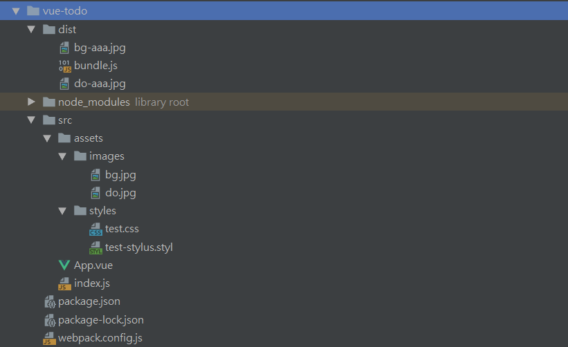
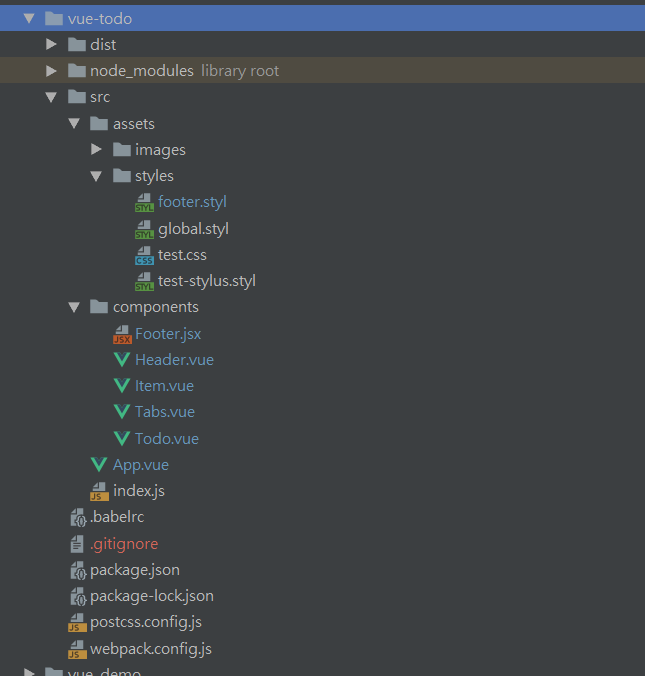

# webpack+vue搭建todo应用

- 目的：
  - 搭建前端工程化项目`webpack`+`vue`

- 目标：
  - 配置开发时前端工程
  - 实现一个简单的TODO应用
  - 优化配置达到上线标准

- 环境版本：

```
"vue": "^2.6.10",
"vue-loader": "^15.7.0",
"vue-template-compiler": "^2.6.10",
"webpack": "^4.32.2",
"webpack-dev-server": "^3.5.1"，
"webpack-cli": "^3.3.2"
```

- 依赖：

```
"dependencies": {
    "autoprefixer": "^9.5.1",
    "babel-core": "^6.26.3",
    "babel-loader": "^7.1.5",
    "babel-plugin-syntax-jsx": "^6.18.0",
    "babel-plugin-transform-vue-jsx": "^3.7.0",
    "babel-preset-env": "^1.7.0",
    "cross-env": "^5.2.0",
    "css-loader": "^2.1.1",
    "extract-text-webpack-plugin": "^4.0.0-beta.0",
    "file-loader": "^3.0.1",
    "html-webpack-plugin": "^3.2.0",
    "postcss-loader": "^3.0.0",
    "style-loader": "^0.23.1",
    "stylus": "^0.54.5",
    "stylus-loader": "^3.0.2",
    "url-loader": "^1.1.2",
    "vue": "^2.6.10",
    "vue-loader": "^15.7.0",
    "vue-template-compiler": "^2.6.10",
    "webpack": "^4.32.2",
    "webpack-dev-server": "^3.5.1"
  },
  "devDependencies": {
    "webpack-cli": "^3.3.2"
  }
```

# `vue+webpack`项目工程配置

## 创建`webpack`项目

### 项目初始化

- 进入项目文件夹，在终端

```cmd
npm init
```

生成 `package.json`

- 安装包和依赖

```cmd
npm install webpack vue vue-loader
```

- 安装后会出现一些提醒，根据提醒把需要的依赖装上去

```cmd
npm i css-loader vue-template-compiler 
```

此时项目就初始化好了。

## `webpack`项目配置

### 编写简单组件

- 建立文件夹 `src` ，文件夹`src/assets`，文件`src/App.vue`，入口文件`src/index.js`

在`App.vue`中写如下简单组件代码：

```javascript
// App.vue

<template>
  <div id="test">{{text}}</div>
</template>

<script>
export default {
  data() {
    return {
      text: 'abcd'
    }
  }
}
</script>

<style>
  #test {
    color: red;
  }
</style>
```

显然这个组件是无法在浏览器中直接运行的，下面的操作使它可以运行。

- 在`index.js`中将`App`组件挂载到`dom`节点中。

```javascript
// index.js

/**
 * 入口文件
 */
import Vue from 'vue';
import App from './App.vue';

const root = document.createElement('div');
document.body.appendChild(root);

// 创建Vue对象，将App组件挂载到root节点
new Vue({
  render: (h) => h(App)
}).$mount(root)
```

> `webpack`是帮我们打包前端资源的，我们的前端资源有很多类型，比如说`javascript` , `css `,`images`，字体等，这些都是要通过`http`请求去加载的内容。

- 在 `package.json`同级位置建立`webpack.config.js`文件。

```javascript
// webpack.config.js

// path是nodejs中的一个基本包，用来处理路径的
const path = require('path');
const VueLoaderPlugin = require('vue-loader/lib/plugin');

module.exports = {
  // 声明入口,entry使用绝对路径，保证不出错误
  entry: path.join(__dirname, 'src/index.js'),
  mode: 'production',
  // 出口
  output: {
    // 输出打包文件名（将index.js以及其依赖的资源打包成bundle.js）
    filename: 'bundle.js',
    // 输出路径
    path: path.join(__dirname, 'dist')
  },
  module: {
    rules: [
      {
        test: /.vue$/,
        loader: 'vue-loader'
      },
      {
        test: /.css$/,
        loader:['css-loader']
      }
    ]
  },
  plugins: [
    new VueLoaderPlugin()
  ]
}
```

- 在`package.json`中添加`build`:

> 只有在这里调用这个`webpack`，才会调用我们安装在项目里面的`webpack`，如果不在这里添加，直接在命令行里面输，则使用的是全局的`webpack`，版本可能不一样，应该在这里添加。

```json
// package.json

"scripts": {
    "test": "echo \"Error: no test specified\" && exit 1",
+   "build": "webpack --config webpack.config.js"
  },
```

- 运行

```cmd
npm run build
```

此时在项目文件夹下生成`dist`文件夹及`dist/bundle.js`

### 一些`loader`配置

- 在 `webpack.config.js`中添加下列内容：

```javascript
module: {
    rules: [
      {
        test: /\.vue$/,
        loader: 'vue-loader'
      },
      {
        test: /\.css$/,
        use: [
          'style-loader',
          'css-loader'
        ]
      },
      {
        test: /\.(gif|jpg|jpeg|png|svg)$/,
        use: [
          {
            loader:  'url-loader',
            options: {
              limit: 1024,
              name: '[name]-aaa.[ext]'
            }
          }
        ]
      }
    ]
  }
```

安装上面对应的`loader`

```cmd
npm i style-loader url-loader file-loader
```

- 在 `assets`文件夹中创建`assets/images`,`assets/styles`

- 在 `styles`下创建`test.css`

```css
body{
     color: red;
     background-image: url('../images/do.jpg');
 }
```

- 在`index.js`中`import`这个`test.css`和图片文件

```javascript
// index.js

import './assets/styles/test.css';
import './assets/images/bg.jpg';
```

- 执行

```cmd
npm run build
```

可以看到图片被打包到了`dist文件夹下`。`bundle.js`中也有了`test.css`的内容.

- 在 `webpack.config.js`的module模块的rules中添加css预处理器的规则。

```javascript
{
  test: /\.styl/,
  use: [
  	'style-loader',
  	'css-loader',
  	'stylus-loader'
	]
}
```

```cmd
npm i stylus-loader stylus
```

- 在 `styles`目录下新建`test-stylus.styl`文件

```stylus
// test-stylus.styl

body
  font-size 20px
```

- 在 `index.js`中引入`test-stylus.styl`

```javascript
import './assets/styles/test-stylus.styl';
```

- 运行

```cmd
npm run build
```

此时项目的目录结构如下：


## 配置`webpack-dev-server`

- `webpack-dev-server`是一个`webpack`的包，功能非常强大，可以去`webpack`官网<https://webpack.docschina.org/configuration/>查看详细配置。首先安装：

```cmd
npm i webpack-dev-server
```

- 在`package.json`中添加"dev"

```json
"scripts": {
    "test": "echo \"Error: no test specified\" && exit 1",
    "build": "webpack --config webpack.config.js",
+   "dev": "webpack-dev-server --config webpack.config.js"
  },
```

修改`webpack.config.js`的配置来适应`webpack-dev-server`的开发模式。

```javascript
module.exports = {
  // 编译目标是web平台
+ target: 'web',
```

因为在不同的平台上设置环境变量的方式是不一样的，使用`cross-env`来在不同的环境下使用同样的脚本。

```cmd
npm i cross-env
```

修改`package.json`

```json
"scripts": {
    "test": "echo \"Error: no test specified\" && exit 1",
-   "build": "webpack --config webpack.config.js",
+   "build": "cross-env NODE_ENV=production webpack --config webpack.config.js",
-   "dev": "webpack-dev-server --config webpack.config.js",
+   "dev": "cross-env NODE_ENV=development webpack-dev-server --config webpack.config.js"
  },
```

在`webpack.config.js`中判断：

```javascript
// webpack.config.js
// path是nodejs中的一个基本包，用来处理路径的
const path = require('path');
const VueLoaderPlugin = require('vue-loader/lib/plugin');

- module.exports = {
+ const isDev = process.env.NODE_ENV === 'development';

+ const config = {
  ...
}

+ if(isDev){
+  config.devServer = {
    // 端口
    port: 8080,
    // 主机
    host: '0.0.0.0',
    // 使webpack错误显示到页面上
    overlay: {
      error: true,
    }
  }
}


```

- 添加`html`文件使项目在浏览器中能打开。
- 添加`html`插件

```cmd
npm i html-webpack-plugin
```

配置插件：

```javascript
+ const HTMLPlugin = require('html-webpack-plugin');

plugins: [
+   new webpack.DefinePlugin({
      'process.env': {
        NODE_ENV: isDev ? '"development"' : '"production"'
      }
    }),
    new VueLoaderPlugin(),
+   new HTMLPlugin()
  ]
```

运行： 

```cmd
npm run dev
```

在浏览器中访问：<http://127.0.0.1:8080/>或<http://localhost:8080/>

此时改变页面内容，**保存**，浏览器的显示可以自动刷新！！

- 添加热替换和`devtool`

```javascript
// 如果是开发模式，则进行下列配置
if(isDev){
  // 控制是否生成，以及如何生成 source map
+ config.devtool = '#cheap-module-eval-source-map';
  config.devServer = {
    // 端口
    port: 8080,
    // 主机
    host: '0.0.0.0',
    // 使webpack错误显示到页面上
    overlay: {
      error: true,
    },
    // 自动打开浏览器
    // open: true,
    // 模块热替换，只更新更改的部分
+   hot: true
  };
  // 添加插件
+ config.plugins.push(
    // 热模块替换插件
    new webpack.HotModuleReplacementPlugin(),
    new webpack.NoEmitOnErrorsPlugin()
  );
}
```

- 重启

```cmd
npm run dev
```

改变内容，页面局部刷新。

### 配置完成

此时的文件内容：

```javascript
// webpack.config.js

// path是nodejs中的一个基本包，用来处理路径的
const path = require('path');
const VueLoaderPlugin = require('vue-loader/lib/plugin');
const HTMLPlugin = require('html-webpack-plugin');
const webpack = require('webpack');

const isDev = process.env.NODE_ENV === 'development';

const config = {
  // 编译目标是web平台
  target: 'web',
  // 声明入口,entry使用绝对路径，保证不出错误
  entry: path.join(__dirname, 'src/index.js'),
  mode: 'production',
  // 出口
  output: {
    // 输出打包文件名（将index.js以及其依赖的资源打包成bundle.js）
    filename: 'bundle.js',
    // 输出路径
    path: path.join(__dirname, 'dist')
  },
  module: {
    rules: [
      {
        test: /\.vue$/,
        loader: 'vue-loader'
      },
      {
        test: /\.css$/,
        use: [
          'style-loader',
          'css-loader'
        ]
      },
      {
        test: /\.(gif|jpg|jpeg|png|svg)$/,
        use: [
          {
            loader:  'url-loader',
            options: {
              limit: 1024,
              name: '[name]-aaa.[ext]'
            }
          }
        ]
      },
      {
        test: /\.styl/,
        use: [
          'style-loader',
          'css-loader',
          'stylus-loader'
        ]
      }
    ]
  },
  plugins: [
    new webpack.DefinePlugin({
      'process.env': {
        NODE_ENV: isDev ? '"development"' : '"production"'
      }
    }),
    new VueLoaderPlugin(),
    new HTMLPlugin()
  ]
}

// 如果是开发模式，则进行下列配置
if(isDev){
  // 控制是否生成，以及如何生成 source map
  config.devtool = '#cheap-module-eval-source-map';
  config.devServer = {
    // 端口
    port: 8080,
    // 主机
    host: '0.0.0.0',
    // 使webpack错误显示到页面上
    overlay: {
      error: true,
    },
    // 自动打开浏览器
    // open: true,
    // 模块热替换，只更新更改的部分
    hot: true
  };
  // 添加插件
  config.plugins.push(
    // 热模块替换插件
    new webpack.HotModuleReplacementPlugin(),
    new webpack.NoEmitOnErrorsPlugin()
  );
}

module.exports = config;
```

此时的文件内容：

```json
// package.json

{
  "name": "vue-todo",
  "version": "1.0.0",
  "description": "",
  "main": "index.js",
  "scripts": {
    "test": "echo \"Error: no test specified\" && exit 1",
    "build": "cross-env NODE_ENV=production webpack --config webpack.config.js",
    "dev": "cross-env NODE_ENV=development webpack-dev-server --config webpack.config.js"
  },
  "author": "",
  "license": "ISC",
  "dependencies": {
    "cross-env": "^5.2.0",
    "css-loader": "^2.1.1",
    "file-loader": "^3.0.1",
    "html-webpack-plugin": "^3.2.0",
    "style-loader": "^0.23.1",
    "stylus": "^0.54.5",
    "stylus-loader": "^3.0.2",
    "url-loader": "^1.1.2",
    "vue": "^2.6.10",
    "vue-loader": "^15.7.0",
    "vue-template-compiler": "^2.6.10",
    "webpack": "^4.32.2",
    "webpack-dev-server": "^3.5.1"
  },
  "devDependencies": {
    "webpack-cli": "^3.3.2"
  }
}
```

到此时为止，项目配置基本完成，之后写业务逻辑。

# `vue`介绍和项目实战

vue是一个数据绑定的组件化的框架

数据绑定

vue文件开发方式

render方法

API重点：

- 生命周期方法

- computed

## 配置`vue`的`jsx`写法以及`postcss`

- 在正式开发之前，安装下列依赖：

```cmd
npm i postcss-loader autoprefixer babel-loader babel-cor
```

- 在项目根目录下建立两个配置文件：`.babelrc`，`postcss.config.js`

```cmd
npm i babel-preset-env babel-plugin-transform-vue-jsx
```

```javascript
// postcss.config.js

const autoprefixer = require('autoprefixer');

module.exports = {
  plugins: [
    autoprefixer()
  ]
};
```

```javascript
// .babelrc

{
  "presets": [
    "env"
  ],
  "plugins": [
    "transform-vue-jsx"
  ]
}
```

- 在`webpack.config.js`中配置

```javascript
{
  test: /\.jsx$/,
  loader: 'babel-loader'
},
```

## 实现`todo`应用界面

在`src`目录下新建`src/components`目录，新建`Header.vue`，`Todo.vue`，`Item.vue`，`Tabs.vue`，`Footer.jsx`这些组件和`global.styl`。

目录结构如下：


```javascript
// index.js

/**
 * 入口文件
 */
import Vue from 'vue';
import App from './App.vue';

import '../src/assets/styles/global.styl';

const root = document.createElement('div');
document.body.appendChild(root);

// 创建Vue对象，将App组件挂载到root节点
new Vue({
  render: (h) => h(App)
}).$mount(root);
```

```vue
<!-- Header.vue-->

<template>
  <header class="main-header">
    <h1>ToDo</h1>
  </header>
</template>

<style lang="stylus" scoped>
  .main-header {
    text-align: center;

    h1 {
      font-size: 100px;
      color: palevioletred;
      font-weight: 100px;
      margin: 50px;
    }
  }
</style>
```

```vue
<!--Todo.vue-->

<template>
  <section class="real-app">
    <input
      type="text"
      class="add-input"
      autofocus="autofocus"
      placeholder="添加任务"
      @keyup.enter="addTodo"
    >
    <Item
      :todo="todo"
      v-for="todo in filteredTodos"
      :key="todo.id"
      @del="deleteTodo"
    />
    <Tabs
      :filter="filter"
      :todos="todos"
      @toggle="toggleFilter"
      @clearAllCompleted="clearAllCompleted"
    />
  </section>
</template>

<script>
  import Item from './Item.vue';
  import Tabs from './Tabs.vue';
  let id = 0;
  export default {
    data(){
      return {
        todos: [],
        filter: "all"
      }
    },
    components: {
      Item,
      Tabs
    },
    computed: {
      filteredTodos(){
        // 如果 filter的状态为all，显示所有的todos
        if(this.filter === 'all'){
          return this.todos;
        }
        // 筛选的方法就是让this.filter等于todo.completed，
        // 但是filter是一个字符串，所以加下面这个条件判断，
        // 得到一个true或false的值，用它去过滤todos列表
        const completed = this.filter === 'completed';
        // filter的结果返回true则显示，返回false则不显示
        return this.todos.filter(todo => completed === todo.completed)
      }
    },
    methods: {
      addTodo(e) {
        this.todos.unshift({
          id: id++,
          content: e.target.value.trim(),
          completed: false
        });
        e.target.value = '';
      },
      deleteTodo(id){
        this.todos.splice(this.todos.findIndex(todo => todo.id === id), 1);
      },
      toggleFilter(state){
        this.filter = state;
      },
      clearAllCompleted(){
        this.todos = this.todos.filter(todo => !todo.completed);
      }
    }
  }
</script>

<style scoped>
  .real-app {
    width: 600px;
    margin: 0 auto;
    box-shadow: 0 0 5px #666;
  }

  .add-input {
    position: relative;
    width: 100%;
    min-height: 40px;
    padding-left: 60px;
    line-height: 40px;
    font-size: 16px;
    border: 3px solid pink;
    box-sizing: border-box;
    background-color: ghostwhite;
  }
</style>
```

```vue
<!--Item.vue-->

<template>
  <div :class="['todo-item', todo.completed ? 'completed' : '']">
    <input
      type="checkbox"
      id="toggle"
      v-model="todo.completed"
    >
    <label>{{todo.content}}</label>
    <button class="del" @click="deleteTodo"></button>
  </div>
</template>

<script>
  export default {
    props: {
      todo: {
        type: Object,
        required: true,
      }
    },
    methods: {
      deleteTodo() {
        // 触发事件,在父组件中用@del="deleteTodo"的方式监听，
        // 实现父子组件间事件的解耦
        this.$emit('del', this.todo.id);
      }
    }
  }
</script>

<style lang="stylus" scoped>
  .todo-item {
    position: relative;
    background-color: white;
    font-size: 24px;
    border-bottom: 1px solid pink;

    &:hover {
      .del:after {
        content: 'x';
      }
    }

    label {
      white-space: pre-line;
      word-break: break-all;
      padding: 15px 60px 15px 15px;
      margin-left: 45px;
      display: block;
      line-height: 1.2;
      transition: color 0.4s;
    }

    &.completed {
      label {
        color: #d9d9d9;
        text-decoration: line-through;
      }
    }
  }

  #toggle {
    position: absolute;
    text-align: center;
    width: 20px;
    height: 20px;
    left: 10px;
    top: 0;
    bottom: 0;
    margin: auto 0;
    border: none;
    outline: none;
  }

  .del {
    position: absolute;
    top: 0;
    bottom: 0;
    right: 10px;
    width: 40px;
    height: 40px;
    margin: auto 0;
    color: red;
    background-color: transparent;
    font-size: 30px;
    border-width: 0;
    cursor: pointer;
    outline: none;
  }
</style>
```

```vue
<!--Tabs.vue-->

<template>
  <div class="helper">
    <span class="left">{{unFinishedTodoLength}} items left</span>
    <span class="tabs">
      <span
        v-for="state in states"
        :key="state"
        :class="[state, filter === state ? 'actived' : '']"
        @click="toggleFilter(state)"
      >
        {{state}}
      </span>
    </span>
    <span class="clear" @click="clearAllCompleted">Clear completed</span>
  </div>
</template>

<script>
  export default {
    props: {
      filter: {
        type: String,
        required: true,
      },
      todos: {
        type: Array,
        required: true
      }
    },
    data() {
      return {
        states: ['all', 'active', 'completed']
      }
    },
    computed: {
      unFinishedTodoLength() {
        return this.todos.filter(todo => !todo.completed).length;
      }
    },
    methods: {
      toggleFilter(state) {
        this.$emit('toggle', state);
      },
      clearAllCompleted() {
        this.$emit('clearAllCompleted');
      }
    }
  }
</script>

<style lang="stylus" scoped>
  .helper {
    font-family: Georgia, serif;
    font-weight: 100;
    display: flex;
    justify-content: space-between;
    padding: 5px 0;
    line-height: 30px;
    background-color: #fff;
    font-size: 14px;
  }

  .left, .clear, .tabs {
    padding: 0 10px;
    box-sizing: border-box;
  }

  .left, .clear {
    width: 150px;
  }

  .left {
    text-align: left;
  }

  .clear {
    text-align: right;
    cursor: pointer;
  }

  .tabs {
    width: 200px;
    display: flex;
    justify-content: space-around;

    * {
      display: inline-block;
      padding 0 10px;
      cursor: pointer;
      border: 1px solid rgba(175, 47, 47, 0);

      &.actived {
        border-color: rgba(175, 47, 47, 0.4);
        border-radius: 5px;
      }
    }
  }
</style>
```

```vue
<!--App.vue-->

<template>
  <div id="app">
    <div id="cover"></div>
    <Header/>
    <Todo/>
    <Footer/>
  </div>
</template>

<script>
  import Header from './components/Header.vue';
  import Footer from './components/Footer.jsx';
  import Todo from './components/Todo.vue';

  export default {
    components: {
      Header,
      Footer,
      Todo
    }
  }
</script>

<style scoped>
  #app {
    position: absolute;
    left: 0;
    right: 0;
    top: 0;
    bottom: 0;
  }

  /* 实现虚化效果*/
  #cover {
    position: absolute;
    left: 0;
    right: 0;
    top: 0;
    bottom: 0;
    background-color: #999;
    opacity: .6;
    z-index: -1;
  }
</style>
```

```jsx
// Footer.jsx

import '../assets/styles/footer.styl';

export default {
  data() {
    return {
      author: 'MandyShen'
    }
  },
  render() {
    return (
      <div id="footer">
        <span>Written by {this.author}</span>
      </div>
    )
  }
};
```

```stylus
//footer.styl

#footer{
  margin-top 40px
  text-align center
  color mediumvioletred
  font-size 18px
  text-shadow 0 1px 0 #2b81af
}
```

# `webpack`配置优化

## `webpack`配置`css`单独分离打包

```cmd
npm i extract-text-webpack-plugin
```

作用是将非`javascript`代码的资源单独打包成一个静态资源文件。

- 在`webpack.config.js`中引入

```js
// webpack.config.js

const ExteactPlugin = require('extract-text-webpack-plugin');
```

## `webpack`区分打包类库代码及`hash`优化

```js
// webpack.config.js

// path是nodejs中的一个基本包，用来处理路径的
const path = require('path');
const VueLoaderPlugin = require('vue-loader/lib/plugin');
const HTMLPlugin = require('html-webpack-plugin');
const webpack = require('webpack');
const ExtractPlugin = require('extract-text-webpack-plugin');

const isDev = process.env.NODE_ENV === 'development';

const config = {
  // 编译目标是web平台
  target: 'web',
  // 声明入口,entry使用绝对路径，保证不出错误
  entry: path.join(__dirname, 'src/index.js'),
  // mode: 'production',
  // 出口
  output: {
    // 输出打包文件名（将index.js以及其依赖的资源打包成bundle.js）
    filename: 'bundle.[hash:8].js',
    // 输出路径
    path: path.join(__dirname, 'dist')
  },
  module: {
    rules: [
      {
        test: /\.vue$/,
        loader: 'vue-loader'
      },
      {
        test: /\.jsx$/,
        loader: 'babel-loader'
      },
      {
        test: /\.css$/,
        use: [
          'style-loader',
          'css-loader'
        ]
      },
      {
        test: /\.(gif|jpg|jpeg|png|svg)$/,
        use: [
          {
            loader: 'url-loader',
            options: {
              limit: 1024,
              name: '[name]-aaa.[ext]'
            }
          }
        ]
      },

    ]
  },
  plugins: [
    new webpack.DefinePlugin({
      'process.env': {
        NODE_ENV: isDev ? '"development"' : '"production"'
      }
    }),
    new VueLoaderPlugin(),
    new HTMLPlugin()
  ]
}

// 如果是开发模式，则进行下列配置
if (isDev) {
  config.module.rules.push({
    test: /\.styl/,
    use: [
      'style-loader',
      'css-loader',
      {
        loader: 'postcss-loader',
        options: {
          sourceMap: true,
        }
      },
      'stylus-loader'
    ]
  });
  // 控制是否生成，以及如何生成 source map
  config.devtool = '#cheap-module-eval-source-map';
  config.devServer = {
    // 端口
    port: 8080,
    // 主机
    host: '0.0.0.0',
    // 使webpack错误显示到页面上
    overlay: {
      error: true,
    },
    // 自动打开浏览器
    // open: true,
    // 模块热替换，只更新更改的部分
    hot: true
  };
  // 添加插件
  config.plugins.push(
    // 热模块替换插件
    new webpack.HotModuleReplacementPlugin(),
    new webpack.NoEmitOnErrorsPlugin()
  );
} else {
  config.entry = {
    app: path.join(__dirname, 'src/index.js'),
    vendor: ['vue']
  };
  config.output.filename = '[name].[chunkhash:8].js';
  config.module.rules.push(
    {
      test: /\.styl/,
      use: ExtractPlugin.extract({
        fallback: 'style-loader',
        use: [
          'css-loader',
          {
            loader: 'postcss-loader',
            options: {
              sourceMap: true,
            }
          },
          'stylus-loader'
        ]
      })
    },
  );
  config.plugins.push(
    new ExtractPlugin('styles.[hash:8].css')
  );
  config.optimization = {
    splitChunks: {
      cacheGroups: {
        commons: {
          chunks: 'initial',
          minChunks: 2, maxInitialRequests: 5,
          minSize: 0
        },
        vendor: {
          test: /node_modules/,
          chunks: 'initial',
          name: 'vendor',
          priority: 10,
          enforce: true
        }
      }
    },
    runtimeChunk: true
  }
}

module.exports = config;
```

